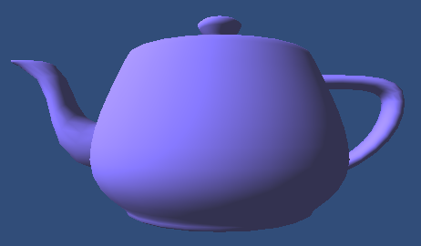
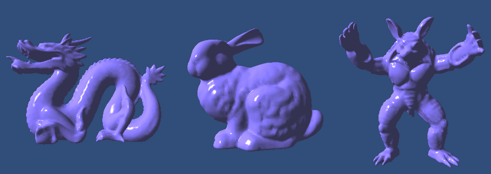
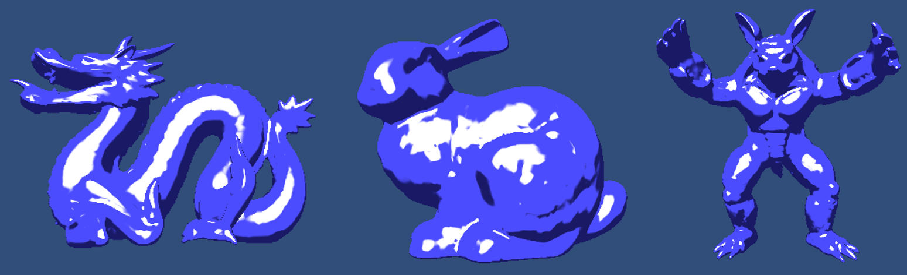

Simple Unity Shaders
====

Simple Unity Shader implementation examples:

* **Lambert shading**
* **Phong shading**
* **Toon shading**

These shaders are are all written in Cg shader language.
Main shading functions are defined in the fragment shader.

## Result
### Lambert

### Phong

### Toon

## Usage
### Directory Structure
* [ShaderName]
 - [ShaderName]Shader.shader: main Unity shader file.

### Unity
You can load Cg shaders (**LambertShader.shader**, **PhongShader.shader**, **ToonShader.shader**) as a custom Unity shader.

1. Create a material.
    *  **Assets->Create->Material** from the main menu or the Project View context menu.
2. Set the shader property.
    * Select the target shader (**LambertShader.shader**, etc.).
    * Shader attributes are automatically loaded in the Inspector.

## License

The MIT License 2015 (c) tody
